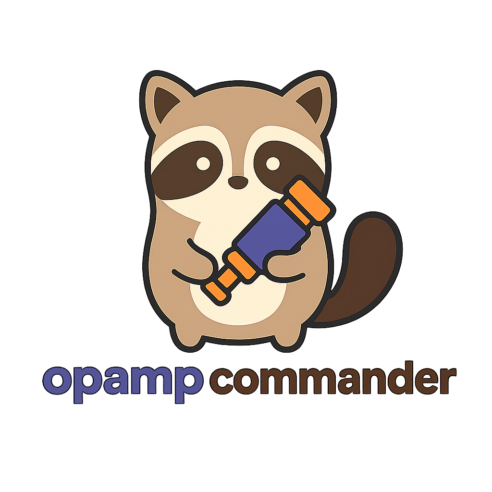
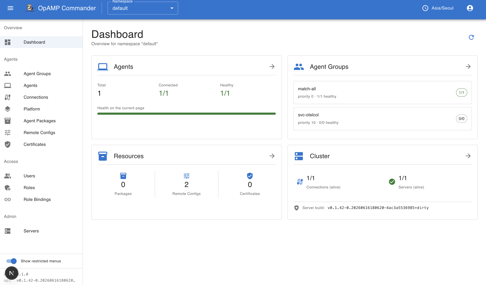
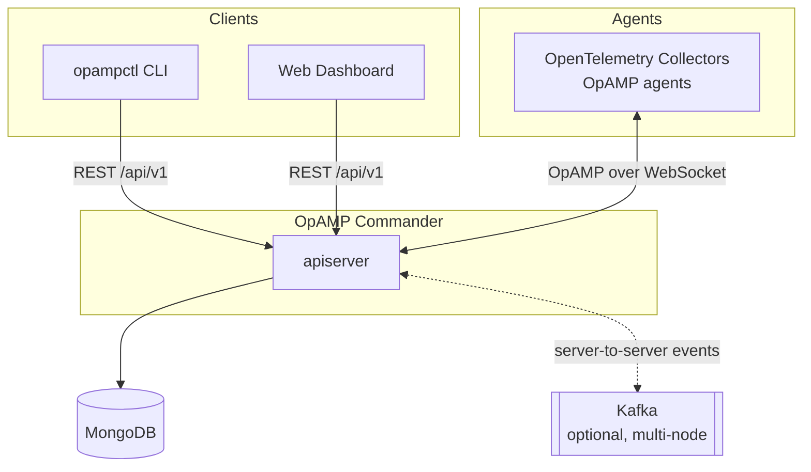

<p align="center">
  
</p>

# OpAMP Commander

OpAMP Commander is a management platform for OpenTelemetry collectors/agents that
implements the [OpAMP protocol](https://opentelemetry.io/docs/specs/opamp/). It lets
you manage, monitor, and remotely configure a fleet of agents from a central place.

<p align="center">
  
</p>

It is made of three components:

| Component | Path | Description |
|---|---|---|
| **apiserver** | `cmd/apiserver` | The server. Hosts the OpAMP WebSocket endpoint that agents connect to, plus a REST API for managing agents, configuration, namespaces, RBAC and certificates. |
| **opampctl** | `cmd/opampctl` | A `kubectl`-style command-line client for the apiserver. |
| **web** | `web/` | A Next.js + MUI dashboard for the apiserver. |

📖 **Full documentation:** <https://minuk-dev.github.io/opampcommander/>

## How it works



- Agents connect to the apiserver's OpAMP WebSocket endpoint (`/api/v1/opamp`) for
  bidirectional management.
- Operators drive the apiserver through the REST API, via `opampctl` or the web dashboard.
- State is persisted in MongoDB (an in-memory store is available for development).
- In multi-node deployments, servers coordinate through Kafka so that a management
  request received by one server can be delivered to an agent connected to another.
  Single-node deployments use an in-memory event bus instead (standalone mode).

Agents are organized into **namespaces**, derived from each agent's
`service.namespace` identifying attribute (defaulting to `default`).

## Quick start

### Prerequisites

- Go 1.25+
- Docker (for MongoDB / Kafka during development)
- Node.js 20.9+ (only to run the web dashboard)

### Run the apiserver

Standalone mode (MongoDB only, no Kafka):

```sh
make run-standalone
```

Full development mode (MongoDB + Kafka):

```sh
make run-dev-server
```

Or run directly against a config file:

```sh
go run ./cmd/apiserver/main.go --config ./configs/apiserver/dev.yaml
```

The server listens on `localhost:8080` (API) and `localhost:9090` (management:
health checks, metrics, pprof) by default.

### Install and use opampctl

```sh
# install
go install github.com/minuk-dev/opampcommander/cmd/opampctl@latest

# create a config file at ~/.config/opampcommander/opampctl/config.yaml
opampctl config init

# inspect the fleet
opampctl get agent
opampctl whoami
```

See the [CLI reference](https://minuk-dev.github.io/opampcommander/docs/cli/) for the
full command set.

### Run the web dashboard

```sh
cd web
npm install
OPAMP_API_URL=http://localhost:8080 npm run dev
```

Open <http://localhost:3000>. See [`web/README.md`](web/README.md) for details.

## Development

### Infrastructure

```sh
make start-dev-services    # start MongoDB + Kafka in Docker
make stop-dev-services     # stop (data preserved)
make clean-dev-services    # stop and remove all data
```

### Build & generate

```sh
make generate        # regenerate Swagger docs + mocks (run before build)
make build-dev       # single-target build via goreleaser
make build           # full goreleaser build
```

### Test & lint

```sh
make unittest        # go test -short ./...
make test            # go test -race ./...
make test-e2e        # E2E tests (requires Docker)
make test-e2e-basic  # E2E tests without Kafka
make lint            # golangci-lint
make lint-fix        # golangci-lint --fix
```

For web checks:

```sh
cd web && npx tsc --noEmit && npm run lint && npm test && npm run build
```

## Architecture

The Go code follows **Hexagonal Architecture** wired with **Uber FX** dependency
injection, split into domain / application / adapter layers under
`pkg/apiserver/`. See [`CLAUDE.md`](CLAUDE.md) for a deeper tour, and
[`web/ARCHITECTURE.md`](web/ARCHITECTURE.md) for the frontend's Feature-Sliced
Design layout.

## Documentation site

The published docs live under `docs/` and are built with Hugo + the Docsy theme.
See [`docs/README.md`](docs/README.md) to run the site locally.

## License

See [LICENSE](LICENSE). Security policy: [SECURITY.md](SECURITY.md).

## Credits

- Logo artwork: Generated with OpenAI image generation. Used by the project owner.
