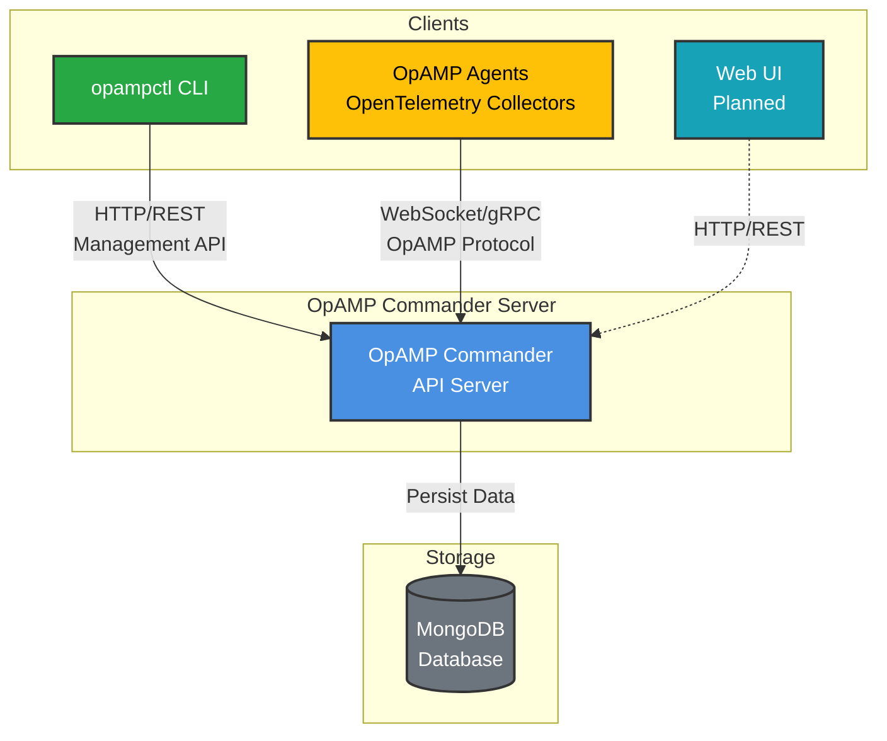
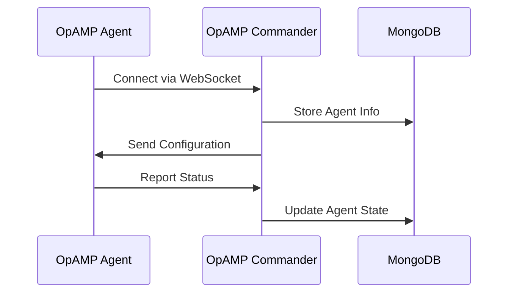
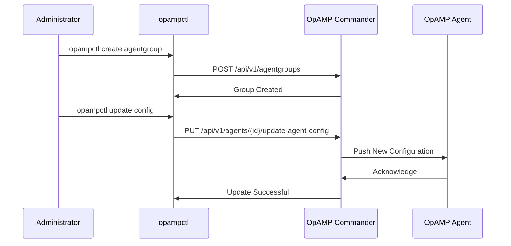

## What is OpAMP Commander?

OpAMP Commander is a comprehensive management platform for OpenTelemetry agents that implements the Open Agent Management Protocol (OpAMP). It provides a centralized solution for managing, monitoring, and configuring distributed telemetry collection agents.

## Key Features

### Centralized Management
Manage all your OpenTelemetry agents from a single web-based interface. Monitor agent health, status, and performance metrics in real-time.

### Dynamic Configuration
Update agent configurations dynamically without restarting agents. Push configuration changes to individual agents or groups of agents instantly.

### Agent Discovery
Automatically discover and register new agents as they come online. Track agent inventory and deployment status across your infrastructure.

### Version Control
Manage agent versions and coordinate upgrades across your fleet. Roll out updates gradually with canary deployments.

### Security
Built-in authentication and authorization ensure secure communication between the server and agents. Support for TLS/SSL encryption and JWT-based authentication.

## Architecture

OpAMP Commander follows a modern, layered architecture designed for scalability and maintainability.

### System Overview

### Component Interactions

**Agent Registration & Management:**

**Configuration Management via CLI:**

### Key Features

- **REST API**: Full-featured HTTP API for programmatic management
- **OpAMP Protocol**: Native support for OpenTelemetry Agent Management Protocol
- **Agent Groups**: Manage multiple agents with shared configurations
- **Authentication**: JWT tokens, OAuth2 (GitHub), Basic Auth
- **Scalability**: Stateless design enabling horizontal scaling

### Technology Stack

- **Backend**: Go 1.21+, Gin web framework
- **Database**: MongoDB 4.4+ for persistence
- **Protocol**: OpAMP over WebSocket/gRPC
- **Observability**: Prometheus metrics, structured logging

## Use Cases

### Infrastructure Monitoring
Deploy and manage OpenTelemetry collectors across your infrastructure for comprehensive observability.

### Microservices Observability
Configure distributed tracing and metrics collection for containerized applications.

### Compliance and Governance
Enforce standardized telemetry collection policies across your organization.

### Cost Optimization
Control sampling rates and filter telemetry data to optimize storage and processing costs.

## Getting Started

Ready to start using OpAMP Commander? Check out our [Getting Started Guide](/en/docs/getting-started/) for installation and setup instructions.
