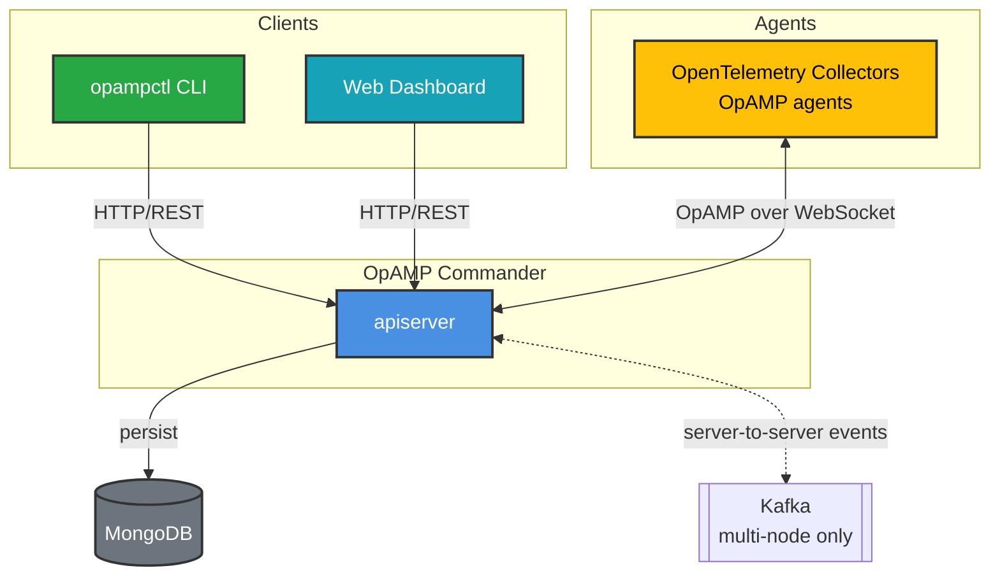
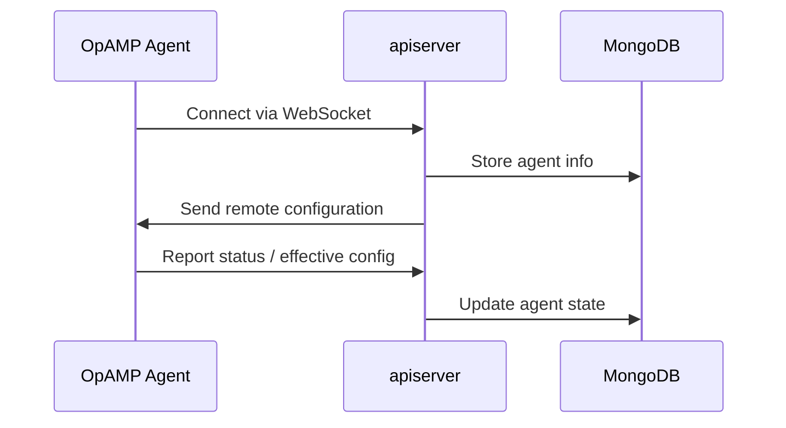
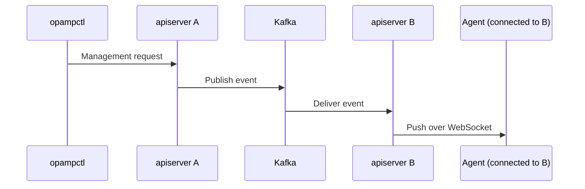

## What is OpAMP Commander?

OpAMP Commander is a management platform for OpenTelemetry agents that implements the
[Open Agent Management Protocol (OpAMP)](https://opentelemetry.io/docs/specs/opamp/).
It provides a centralized way to manage, monitor, and remotely configure distributed
telemetry collection agents.

## Components

| Component | Description |
|---|---|
| **apiserver** | Hosts the OpAMP WebSocket endpoint agents connect to, and a REST API for management. |
| **opampctl** | A `kubectl`-style command-line client. |
| **web** | A Next.js + MUI dashboard. |

## Key features

- **Centralized management** — manage your whole agent fleet from one place.
- **Dynamic configuration** — push remote configuration to individual agents or groups
  without restarting them.
- **Agent discovery** — agents register automatically as they connect; track inventory
  by host, container, and namespace.
- **Agent groups** — apply shared configuration to many agents at once.
- **RBAC** — namespaces, roles, and role bindings, enforced with Casbin.
- **Authentication** — JWT tokens, GitHub OAuth2, and basic auth with hashed passwords.
- **Observability** — Prometheus metrics, structured logging, and OpenTelemetry tracing.

## Architecture

### System overview

```mermaid
graph TB
    subgraph Clients
        CLI[opampctl CLI]
        WebUI[Web Dashboard]
    end
    subgraph Agents
        Agent[OpenTelemetry Collectors<br/>OpAMP agents]
    end
    subgraph Server["OpAMP Commander"]
        API[apiserver]
    end
    DB[(MongoDB)]
    MQ[[Kafka<br/>multi-node only]]

    CLI -->|HTTP/REST| API
    WebUI -->|HTTP/REST| API
    Agent <-->|OpAMP over WebSocket| API
    API -->|persist| DB
    API <-.->|server-to-server events| MQ

    style API fill:#4a90e2,stroke:#333,stroke-width:2px,color:#fff
    style DB fill:#6c757d,stroke:#333,stroke-width:2px,color:#fff
    style CLI fill:#28a745,stroke:#333,stroke-width:2px,color:#fff
    style Agent fill:#ffc107,stroke:#333,stroke-width:2px,color:#000
    style WebUI fill:#17a2b8,stroke:#333,stroke-width:2px,color:#fff
```

### Agent registration & management

```mermaid
sequenceDiagram
    participant Agent as OpAMP Agent
    participant Server as apiserver
    participant DB as MongoDB

    Agent->>Server: Connect via WebSocket
    Server->>DB: Store agent info
    Server->>Agent: Send remote configuration
    Agent->>Server: Report status / effective config
    Server->>DB: Update agent state
```

### Multi-server coordination

When an agent is connected to server B but server A receives a management request,
server A publishes an event to Kafka and server B's consumer delivers it over the
agent's WebSocket. In single-node (standalone) mode an in-memory event bus replaces
Kafka.

```mermaid
sequenceDiagram
    participant CLI as opampctl
    participant A as apiserver A
    participant MQ as Kafka
    participant B as apiserver B
    participant Agent as Agent (connected to B)

    CLI->>A: Management request
    A->>MQ: Publish event
    MQ->>B: Deliver event
    B->>Agent: Push over WebSocket
```

## Technology stack

- **Backend**: Go 1.25, Gin web framework, Uber FX dependency injection
- **Architecture**: Hexagonal (domain / application / adapter layers)
- **Database**: MongoDB (in-memory option for development)
- **Messaging**: Kafka for multi-node coordination (in-memory for standalone)
- **Protocol**: OpAMP over WebSocket
- **Frontend**: Next.js 16 (App Router), React 19, MUI 7, Feature-Sliced Design
- **Observability**: Prometheus, OpenTelemetry tracing, structured logging

## Getting started

Ready to start? See the [Getting Started Guide](/en/docs/getting-started/) for
installation and setup.
