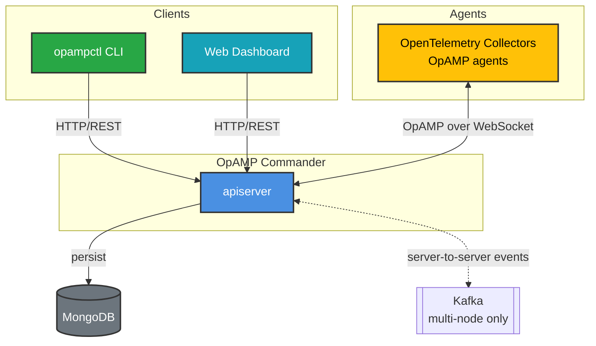
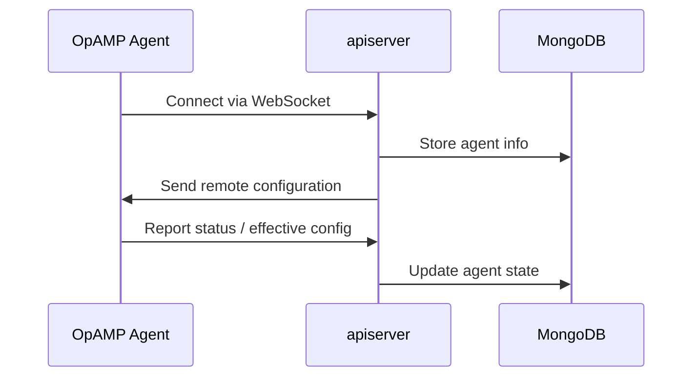
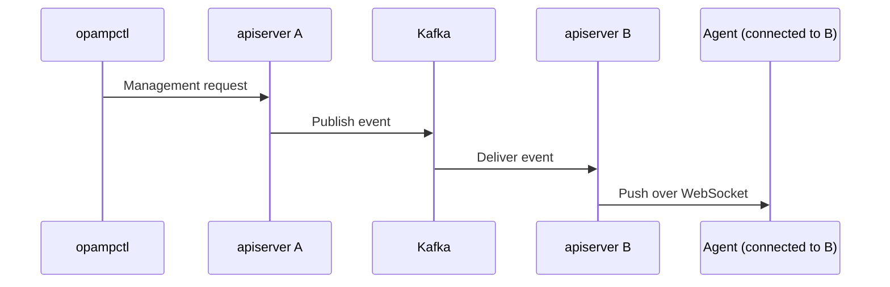

## What is OpAMP Commander?

OpAMP Commander is a management platform for OpenTelemetry agents that implements the
[Open Agent Management Protocol (OpAMP)](https://opentelemetry.io/docs/specs/opamp/).
It provides a centralized way to manage, monitor, and remotely configure distributed
telemetry collection agents.

## Components

| Component | Description |
|---|---|
| **apiserver** | Hosts the OpAMP WebSocket endpoint agents connect to, and a REST API for management. |
| **opampctl** | A `kubectl`-style command-line client. |
| **web** | A Next.js + MUI dashboard. |

## Key features

- **Centralized management** — manage your whole agent fleet from one place.
- **Dynamic configuration** — push remote configuration to individual agents or groups
  without restarting them.
- **Agent discovery** — agents register automatically as they connect; track inventory
  by host, container, and namespace.
- **Agent groups** — apply shared configuration to many agents at once.
- **RBAC** — namespaces, roles, and role bindings, enforced with Casbin.
- **Authentication** — JWT tokens, GitHub OAuth2, and basic auth with hashed passwords.
- **Observability** — Prometheus metrics, structured logging, and OpenTelemetry tracing.

## Architecture

### Service and Store responsibilities

Services must remain **stateless** and contain business logic and operation
orchestration. This rule applies to all resources, including agents, connections,
certificates, agent groups, namespaces, hosts, containers, applications, users,
and RBAC resources.

| Responsibility | Owner |
|---|---|
| Business rules and operation orchestration | Service, using domain models to validate state transitions |
| Resource and session state, including active connections and liveness | Store |
| Caches, indexes, TTL, cloning stored values, and cache invalidation | Store |
| Storage synchronization, version checks, and conditional updates or deletes | Store implementation |

A Service may hold injected dependencies, such as Store ports, a logger, or a
clock, and immutable configuration. Per-operation variables remain local to the
operation. Mutable resource or session state shared between operations must be
owned by a Store rather than a Service.

Store interfaces are domain ports, and their implementations belong in secondary
adapters. A Store may use memory, MongoDB, Redis, or a cache over another Store.
Basic resource access uses the generic `Reader[K, V]` (`Get`) and `Store[K, V]`
(`Get`, `Put`, `Delete`) ports. Resource-specific Store interfaces embed these
contracts and add the operations they need, such as fresh reads, selector queries,
or conditional session deletion. Version checks and cache behavior remain in the
implementations; a generic interface does not make writes unconditional. Read-only
resources expose `Reader` without requiring unused write or delete operations.
The existing `*PersistencePort` interfaces already provide part of this boundary.

The OpAMP and Connection Services share a node-local `ConnectionStore`. It owns
live connection records, agent indexes, session synchronization, the pending
close queue, and cluster snapshot bookkeeping. The Services hold the Store port
and perform business operations within its session scope; they do not own those
maps, queues, or mutexes.

Services rely on atomic Store operations with an expected resource version or
session identity when a state transition requires it. Store implementations
encapsulate the mutexes or conditional database writes needed for those
operations. Guarantees spanning multiple Stores must be defined explicitly;
separate thread-safe methods alone do not make a whole workflow atomic.

Agent and Server Services use read-through Stores over their persistence ports.
The Stores own cache TTL, capacity, cloning, invalidation, and shutdown. Fresh
agent reads bypass the cache when a deletion decision must observe other writers.

The notification Store owns per-server pending UID sets, early-flush signals, and
the dispatch queue. The agent-group change Store queues namespace/name values
and isolated copies of the affected selectors; the Service reloads the current
configuration while still visiting the original members after a selector change
or group recreation. These queues are node-local and best-effort: durable agent messages and the
periodic group reconcile remain their recovery paths. Worker lifetime tracking
is local to each Service Run invocation, not shared resource state.

### System overview

```mermaid
graph TB
    subgraph Clients
        CLI[opampctl CLI]
        WebUI[Web Dashboard]
    end
    subgraph Agents
        Agent[OpenTelemetry Collectors<br/>OpAMP agents]
    end
    subgraph Server["OpAMP Commander"]
        API[apiserver]
    end
    DB[(MongoDB)]
    MQ[[Kafka<br/>multi-node only]]

    CLI -->|HTTP/REST| API
    WebUI -->|HTTP/REST| API
    Agent <-->|OpAMP over WebSocket| API
    API -->|persist| DB
    API <-.->|server-to-server events| MQ

    style API fill:#4a90e2,stroke:#333,stroke-width:2px,color:#fff
    style DB fill:#6c757d,stroke:#333,stroke-width:2px,color:#fff
    style CLI fill:#28a745,stroke:#333,stroke-width:2px,color:#fff
    style Agent fill:#ffc107,stroke:#333,stroke-width:2px,color:#000
    style WebUI fill:#17a2b8,stroke:#333,stroke-width:2px,color:#fff
```

### Agent registration & management

```mermaid
sequenceDiagram
    participant Agent as OpAMP Agent
    participant Server as apiserver
    participant DB as MongoDB

    Agent->>Server: Connect via WebSocket
    Server->>DB: Store agent info
    Server->>Agent: Send remote configuration
    Agent->>Server: Report status / effective config
    Server->>DB: Update agent state
```

### Multi-server coordination

When an agent is connected to server B but server A receives a management request,
server A publishes an event to Kafka and server B's consumer delivers it over the
agent's WebSocket. In single-node (standalone) mode an in-memory event bus replaces
Kafka.

```mermaid
sequenceDiagram
    participant CLI as opampctl
    participant A as apiserver A
    participant MQ as Kafka
    participant B as apiserver B
    participant Agent as Agent (connected to B)

    CLI->>A: Management request
    A->>MQ: Publish event
    MQ->>B: Deliver event
    B->>Agent: Push over WebSocket
```

## Technology stack

- **Backend**: Go 1.25, Gin web framework, Uber FX dependency injection
- **Architecture**: Hexagonal (domain / application / adapter layers)
- **Database**: MongoDB (in-memory option for development)
- **Messaging**: Kafka for multi-node coordination (in-memory for standalone)
- **Protocol**: OpAMP over WebSocket
- **Frontend**: Next.js 16 (App Router), React 19, MUI 7, Feature-Sliced Design
- **Observability**: Prometheus, OpenTelemetry tracing, structured logging

## Getting started

Ready to start? See the [Getting Started Guide](/docs/getting-started/) for
installation and setup.
