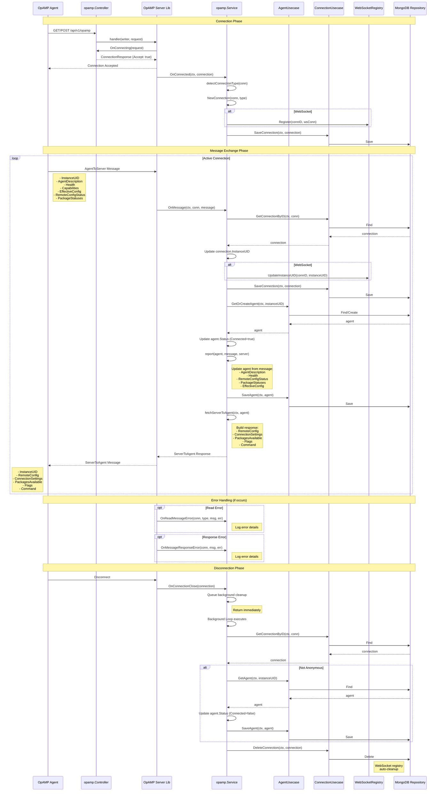
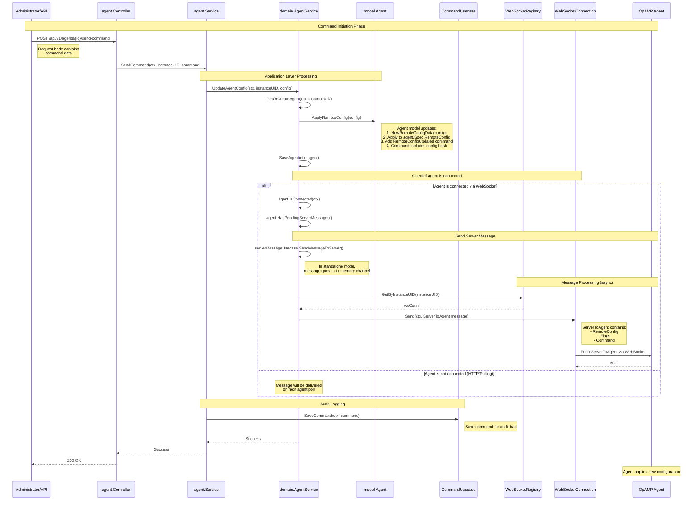

# OpAMP Protocol Execution Sequence

## Agent Connection and Message Exchange Flow



## OpAMP Callbacks Summary

| Callback | When Called | Purpose |
|----------|-------------|---------|
| **OnConnecting** | Before accepting connection | Validate and decide whether to accept |
| **OnConnected** | After connection established | Initialize connection tracking |
| **OnMessage** | When message received from agent | Process agent data and send response |
| **OnReadMessageError** | When failed to read message | Log and handle read errors |
| **OnMessageResponseError** | When failed to send response | Log and handle send errors |
| **OnConnectionClose** | When connection closed | Cleanup resources asynchronously |

## Architecture Layers

The diagram follows Hexagonal Architecture (Ports and Adapters):

### Primary Adapter (Infrastructure - In)
- **opamp.Controller**: HTTP/WebSocket endpoint handler
- **OpAMP Server Lib**: OpAMP protocol implementation library

### Application Layer
- **opamp.Service**: OpAMP protocol callback implementation
- **AgentUsecase**: Agent business logic
- **ConnectionUsecase**: Connection management logic

### Secondary Adapter (Infrastructure - Out)
- **WebSocketRegistry**: WebSocket connection registry
- **MongoDB Repository**: Data persistence

## Connection Types

- **WebSocket**: Bidirectional, persistent, registered in WebSocketRegistry
- **HTTP**: Unidirectional, request-response, not registered

---

## Server-Initiated Command Flow (SendCommand)

This flow shows how the server sends commands to agents, such as updating agent configuration.



### SendCommand Flow Details

#### 1. API Request
- Administrator calls REST API endpoint to send command to agent
- Request includes target agent instance UID and command data

#### 2. Application Layer
- **agent.Service.SendCommand**: Orchestrates the command sending process
  - Calls domain service to update agent config
  - Saves command for audit log

#### 3. Domain Layer
- **AgentService.UpdateAgentConfig**: Business logic for config updates
  - Gets or creates agent model
  - Applies remote config to agent model
  - Saves agent (triggers server message if connected)

#### 4. Agent Model
- **Agent.ApplyRemoteConfig**: Updates agent's remote configuration
  - Creates RemoteConfigData from the provided config using `NewRemoteConfigData()`
  - Marshals config to YAML and computes hash
  - Applies RemoteConfigData to agent's RemoteConfig
  - Adds RemoteConfigUpdated command to agent's Commands list
  - Command includes config hash for tracking

**Key Types** (all in `model` package):
- `RemoteConfig`: Manages remote configuration state
- `RemoteConfigData`: Contains config bytes, hash, and status
- `RemoteConfigStatus`: Config application status (Unset, Applied, Applying, Failed)
- `AgentCommand`: Command to be sent to agent (includes RemoteConfigUpdated flag)

#### 5. Message Delivery (if connected)
- Checks if agent has active WebSocket connection
- Retrieves WebSocket connection from registry
- Sends ServerToAgent message through WebSocket
- Message includes:
  - Remote configuration
  - Flags (e.g., RemoteConfigChanged)
  - Commands

#### 6. Agent Processing
- Agent receives ServerToAgent message
- Applies new configuration
- Sends back status in next AgentToServer message

### Key Components

| Component | Layer | Responsibility |
|-----------|-------|----------------|
| **agent.Controller** | Primary Adapter | HTTP endpoint handler |
| **agent.Service** | Application Layer | Command orchestration |
| **AgentService** | Domain Layer | Agent business logic |
| **CommandUsecase** | Domain Layer | Command audit logging |
| **WebSocketRegistry** | Secondary Adapter | WebSocket connection management |
| **WebSocketConnection** | Secondary Adapter | WebSocket communication |
| **model.Agent** | Domain Model | Agent state including RemoteConfig and Commands |
| **model.RemoteConfig** | Domain Model | Remote configuration management |
| **model.RemoteConfigData** | Domain Model | Config data with hash and status |

### Domain Model Structure

```
Agent
├── Metadata (InstanceUID, Description, Capabilities)
├── Spec
│   └── RemoteConfig (RemoteConfigData, LastErrorMessage)
├── Commands ([]AgentCommand)
│   └── RemoteConfigUpdated, ReportFullState, etc.
└── Status (EffectiveConfig, Health, PackageStatuses)
```

### Message Delivery Modes

- **WebSocket (Push)**: Server immediately pushes configuration to connected agents
- **HTTP (Poll)**: Configuration is delivered when agent next polls the server
- **Hybrid**: Agents can switch between WebSocket and HTTP as needed

### Configuration Update Flow

1. **API Request** → Creates command with config data
2. **Application Layer** → Validates and orchestrates
3. **Domain Layer** → 
   - Calls `agent.ApplyRemoteConfig(config)`
   - Creates `RemoteConfigData` with hash
   - Updates `agent.Spec.RemoteConfig`
   - Adds `RemoteConfigUpdated` to `agent.Commands`
4. **Persistence** → Saves agent with new config and pending command
5. **Message Delivery** → 
   - Retrieves agent from WebSocketRegistry
   - Sends ServerToAgent message with RemoteConfig
   - Agent receives and applies configuration
6. **Status Report** → Agent sends back status in next AgentToServer message
